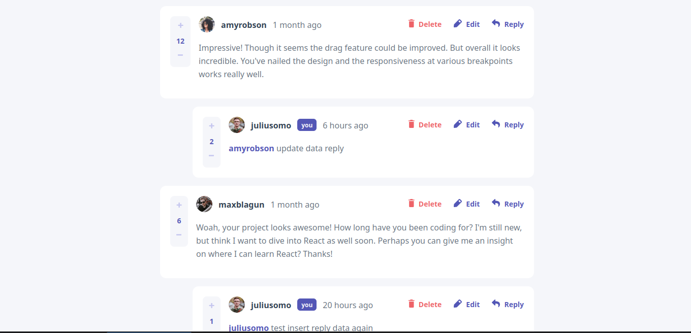

  

  <h2 align="center">Interactive comments section</h2>
	
  

	  
	
	
 

  
  

  

    <a href="https://www.frontendmentor.io/"><strong>Frontend Mentor Challenge</strong></a>
  

#

This is a solution to the [Interactive comments section challenge on Frontend Mentor](https://www.frontendmentor.io/challenges/interactive-comments-section-iG1RugEG9). Frontend Mentor challenges help you improve your coding skills by building realistic projects.  

 

<h2 align="center">Links</h2>

- Solution URL: https://www.frontendmentor.io/solutions/countries-website-iGOcIZEc9v
- Live Site URL: https://interactive-comments-mg.netlify.app/ 
 

## Table of contents

- [Overview](#overview)
    - [The challenge](#the-challenge)
    - [Screenshot](#screenshot)
    - [Links](#links)
- [My process](#my-process)
    - [Built with](#built-with)
    - [What I learned](#what-i-learned)
    - [Useful resources](#useful-resources)
- [Author](#author)

 

## Overview

### The challenge

Users should be able to:

- [x] View the optimal layout for the app depending on their device's screen size
- [x] See hover states for all interactive elements on the page
- [x] Create, Read, Update, and Delete comments and replies
- [x] Upvote and downvote comments
- [x] **Bonus**: If you're building a purely front-end project, use `localStorage` to save the current state in the browser that persists when the browser is refreshed.
- [x] **Bonus**: Instead of using the `createdAt` strings from the `data.json` file, try using timestamps and dynamically track the time since the comment or reply was posted.
- [x] Build this project as a full-stack application  
     

### Screenshot

  
 

## My process

### Built with

**Frontend** : Angular 21, PrimeNG, Tailwind  
**Backend** : FastApi  
**Host**: Netllify, Render
**Database**: Postgresql  
 
### What I learned

- Angular 21
- PrimeNG
- FastApi  
     
### Useful resources

- Angular: https://angular.dev
- Tailwind : https://tailwindcss.com/docs
- FastApi : https://fastapi.tiangolo.com
- Frontendmentor : https://www.frontendmentor.io  
      
     
## Author

- Frontend Mentor - [@ny-aina-solofo](https://www.frontendmentor.io/profile/ny-aina-solofo)
- github : https://github.com/ny-aina-solofo  
      

## Run project locally

This project was generated with Angular CLI version ~21.1.1. To run this project locally. Forked this repo. Install node_modules by running `npm install` Run `npm start` for a dev server. Navigate to http://localhost:4200/. The app will automatically reload if you change any of the source files.